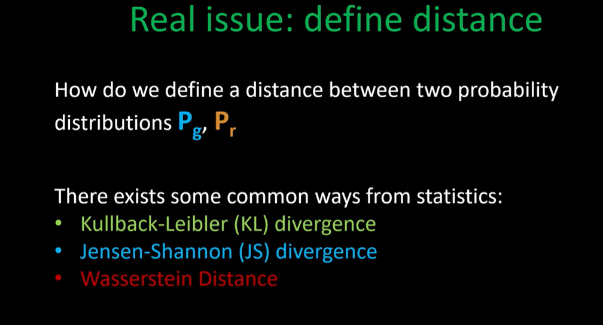

WGAN:

Pros: 
    - Better stability (Prevent: Mode Collapse)
    - Loss means something: Termination criteria

Cons:
    -  *Longer to train?

To understand WGAN, let's recap GANs:

Idea in GANs:

* Two probability distributions:
 - Pg (Distribution that comes out from the generator: Implicit distribution),
 - Pr

