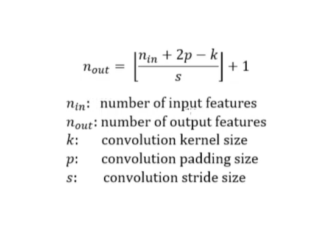

https://docs.pytorch.org/vision/stable/models.html
https://docs.pytorch.org/vision/stable/models/vgg.html

https://pytorch.org/hub

The following classification models are available, with or without pre-trained weights:

- AlexNet
- ConvNeXt
- DenseNet
- EfficientNet
- EfficientNetV2
- GoogLeNet
- Inception V3
- MaxVit
- MNASNet
- MobileNet V2
- MobileNet V3
- RegNet
- ResNet
- ResNeXt
- ShuffleNet V2
- SqueezeNet
- SwinTransformer
- VGG
- VisionTransformer
- Wide ResNet

Resources (Theory):

LeNet Paper:
http://vision.stanford.edu/cs598_spring07/papers/Lecun98.pdf

VGG Paper:
https://arxiv.org/abs/1409.1556

GoogLeNet / InceptionNet Paper:
https://arxiv.org/abs/1409.4842

ResNet Paper:
https://arxiv.org/abs/1512.03385

Neural Style Transfer Paper (NST):
https://arxiv.org/abs/1508.06576

GAN Paper:
https://arxiv.org/abs/1406.2661

DCGAN Paper:
https://arxiv.org/abs/1511.06434

WGAN Resources and Papers:
https://www.alexirpan.com/2017/02/22/wasserstein-gan.html
https://arxiv.org/abs/1701.07875
https://arxiv.org/abs/1704.00028

Pix2Pix Paper:
https://arxiv.org/abs/1611.07004
https://www.youtube.com/watch?v=9SGs4Nm0VR4 (Walkthrough)

Attention is all you need paper (Transformers):
https://arxiv.org/abs/1706.03762

A good blogpost on Transformers:
http://www.peterbloem.nl/blog/transformers

Tensorboard command:

```bash
tensorboard --logdir runs
```
